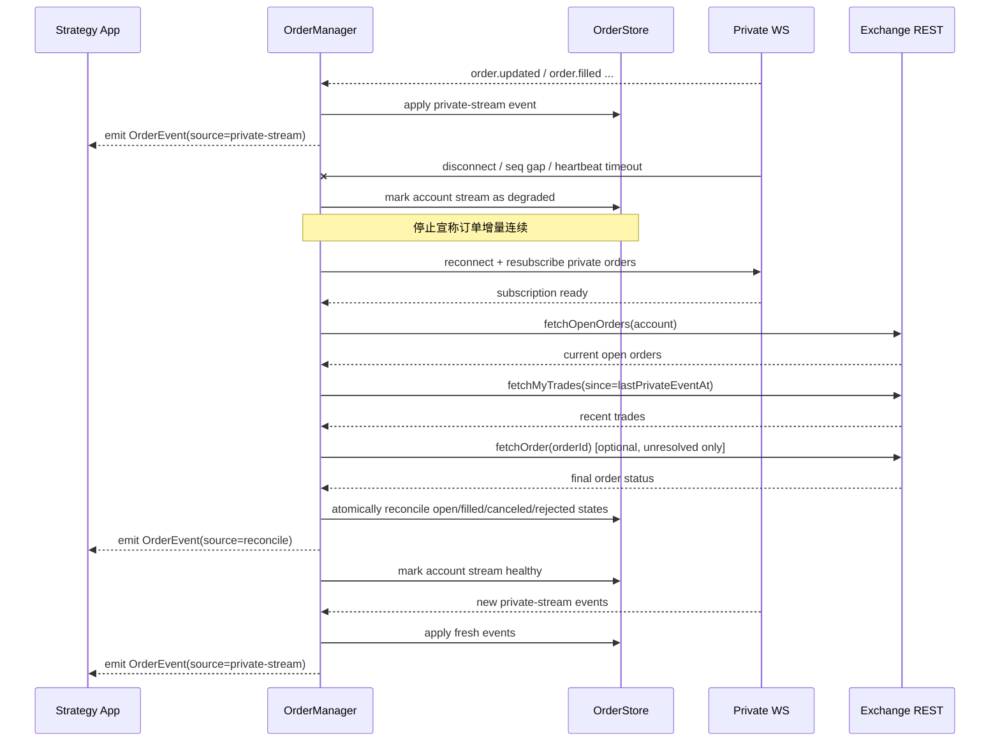
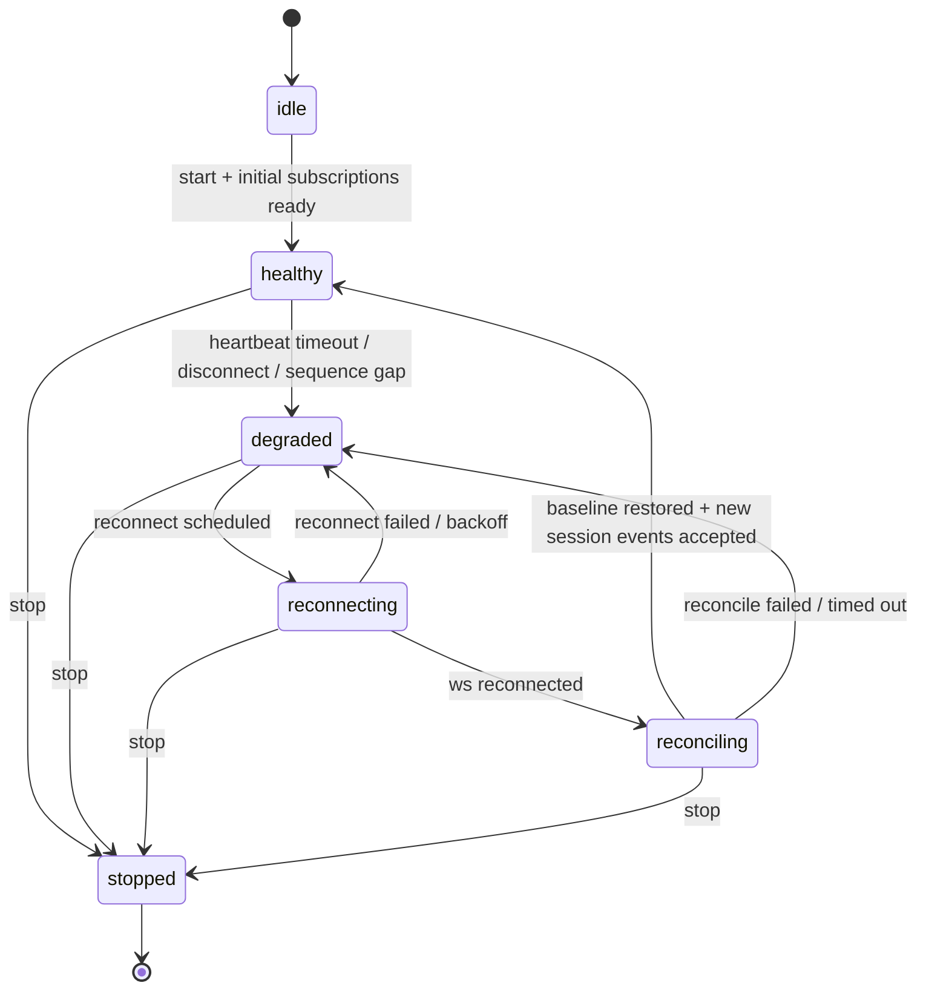

# 多交易所 SDK 对外设计文档

## 文档导航

| 主题 | 位置 | 作用 |
|---|---|---|
| 核心标识与传输协同 | 第 4 章 | 定义 key、REST + WS 搭配方式 |
| 共享契约 | 第 5 章 | 统一数值、时间、freshness、reconcile、degraded 命令语义 |
| Adapter 合同 | 第 7 章 | 统一 CCXT Pro 与原生交易所接入，含重连退避策略 |
| Market / Account / Order 设计 | 第 8-10 章 | 定义三类 manager 的公开 API 和事件语义 |
| 错误模型与生命周期 | 第 12-13 章 | 定义失败语义和 client 生命周期 |
| 实现建议与 MVP 结论 | 第 16-17 章 | 指导 MVP 开发边界与落地顺序 |

## 1. 文档目标

本文档定义一个基于 TypeScript 的多交易所 SDK 的公开接口、事件模型和应用接入方式。

SDK 初期基于 CCXT 构建：

| 能力 | 初期方案 |
|---|---|
| REST 统一接口 | `ccxt` |
| 实时流式能力 | `ccxt-pro` 或后续原生 WS Adapter |
| 多交易所接入 | 通过统一 `ExchangeAdapter` 抽象 |
| 状态维护方式 | SDK 内部组合使用 REST + WS |

本文档关注：

| 范围 | 说明 |
|---|---|
| 对外接口 | 提供给策略应用或上层服务的 SDK API |
| 领域模型 | 行情、账户、订单三类核心数据结构 |
| 事件语义 | 轮询模式与低延迟事件驱动模式如何共存 |
| 应用示例 | 其他应用如何接入和使用 SDK |

不包含：

| 不包含项 | 说明 |
|---|---|
| 具体交易所适配细节 | 例如 Binance / Bybit 的字段映射实现 |
| 完整代码实现 | 本文档是 API 和架构设计，不是最终源码 |
| 分布式部署设计 | 初期先按单进程内存态 SDK 设计 |

### 1.1 术语表

| 术语 | 含义 |
|---|---|
| baseline | 某个时刻通过 REST 或其他权威来源拿到的完整基线快照 |
| reconcile | 在 WS 连续性不再可信后，用 baseline 对本地状态做纠偏与重建 |
| freshness | 某份 market 数据当前是否仍足够新、可用于交易决策 |
| `degraded` | 已确认流式链路异常，不能再宣称增量连续 |
| `reconnecting` | adapter 正在尝试恢复 WS 会话 |
| `reconciling` | WS 已恢复，但 SDK 仍在做状态校准，尚未恢复强正确语义 |
| stale | 最后快照仍可读，但不再推荐用于主动交易决策 |
| `FillDetail` | 单次成交明细，包含价格、数量、手续费等信息 |
| `OrderIdentifier` | 用于定位订单的共享字段集合（accountId + exchange + orderId/clientOrderId） |
| `MarketInfo` | 交易所市场元数据，包含精度、最小下单量等约束 |

## 2. 设计原则

| 原则 | 说明 |
|---|---|
| 统一入口 | 应用只与 SDK 和各类 Manager 交互，不直接依赖交易所 SDK |
| 多交易所 | 同一个应用可同时接入多个交易所、多个账户 |
| 最新状态优先 | `MarketManager` 以“当前最新可交易状态”为核心 |
| 强状态语义 | `AccountManager` 和 `OrderManager` 保留更强的事件顺序语义 |
| 读写分离 | 查询走快照读取，变化感知走事件流 |
| 传输细节内聚 | REST / WS 的选择与组合由 SDK 内部决定，不暴露给使用方 |
| 可替换适配层 | 先用 CCXT，后续可平滑替换成原生 WebSocket 或混合适配 |

## 3. 总体架构

| 层级 | 角色 | 职责 |
|---|---|---|
| `ExchangeAdapter` | 适配层 | 封装 CCXT / CCXT Pro / 原生 WS 的差异，并统一编排 REST/WS |
| `DomainStore` | 状态层 | 保存最新行情、账户、订单状态 |
| `Manager` | 领域层 | 暴露标准接口，协调订阅、更新、查询、命令 |
| `Strategy App` | 应用层 | 读取快照、订阅事件、发起下单或风控逻辑 |

建议 SDK 暴露单一主对象：

```ts
export type ClientStatus = 'idle' | 'starting' | 'running' | 'stopping' | 'stopped';

export interface CreateClientOptions {
  logger?: Console;
  sandbox?: boolean;
  marketFreshness?: Partial<Record<Exchange, MarketFreshnessPolicy>>;
  reconnect?: Partial<ReconnectPolicy>;
}

export interface AcexClient {
  readonly market: MarketManager;
  readonly account: AccountManager;
  readonly order: OrderManager;

  getStatus(): ClientStatus;
  registerAccount(input: RegisterAccountInput): Promise<void>;
  start(): Promise<void>;
  stop(): Promise<void>;
}

export declare function createClient(options?: CreateClientOptions): AcexClient;
```

## 4. 核心标识模型

为了支持多交易所和多账户，所有数据都需要显式带 key。

| 类型 | 含义 | 示例 |
|---|---|---|
| `Exchange` | 交易所标识 | `binance`, `okx`, `bybit`, `gate` |
| `AccountId` | 账户实例标识 | `main-binance`, `arb-bybit-01` |
| `Symbol` | 统一交易对标识 | `BTC/USDT` |
| `MarketKey` | 行情唯一键 | `exchange + symbol` |
| `OrderKey` | 订单唯一键 | `accountId + exchange + orderId/clientOrderId` |

建议输入配置如下：

```ts
export const SUPPORTED_EXCHANGES = ['binance', 'okx', 'bybit', 'gate'] as const;

export type Exchange = (typeof SUPPORTED_EXCHANGES)[number];

export interface RegisterAccountInput {
  accountId: string;
  exchange: Exchange;
  credentials: {
    apiKey: string;
    secret: string;
    password?: string;
  };
  options?: Record<string, unknown>;
}
```

MVP 约束：`accountId` 在同一个 `AcexClient` 实例内必须全局唯一。
因此 `AccountManager` 的大多数查询只需要 `accountId`，不再额外要求调用方重复传 `exchange`。

这里使用 `Exchange` 联合类型而不是裸 `string`，主要是为了：

| 目的 | 说明 |
|---|---|
| 防止拼写错误 | 例如 `binace` 这类错误可以在类型层直接发现 |
| 提供 IDE 补全 | 上层应用接入时更顺手 |
| 避免 `enum` 运行时代码 | 只保留类型约束，不增加额外运行时负担 |

MVP 不再要求显式 `registerExchange()`。SDK 默认内置支持的一组交易所，并按需初始化：

| 场景 | 初始化方式 |
|---|---|
| 公共行情 | 第一次 `subscribeL1Book()` / `subscribeFundingRate()` 时 lazy init 对应交易所 |
| 私有账户/订单 | `registerAccount()` 时初始化对应交易所私有连接 |

关于 `symbol`，SDK 直接沿用 CCXT 的统一命名。

| 场景 | 建议 |
|---|---|
| 现货 | 例如 `BTC/USDT` |
| 永续 / 交割合约 | 例如 `BTC/USDT:USDT`，具体以 CCXT unified market symbol 为准 |

也就是说，外部应用不需要额外传 `marketType`。同一个交易所实例可以同时覆盖 spot / swap / future，具体市场类型由 adapter 基于 `symbol` 和交易所 market metadata 在内部解析。

MVP 默认不引入额外的“交易所实例 ID”层，公开 API 直接使用 `binance / okx / bybit / gate` 这类交易所标识。
如果后续需要支持同一交易所的多实例并存，再额外增加 `instanceId` 即可。

关于传输层，公开 API 不要求调用方声明 `transport`。SDK 默认按下面方式维护状态：

| 内部阶段 | 默认职责 |
|---|---|
| REST bootstrap | 初始化 markets、余额、仓位、订单等基础快照 |
| WS stream | 持续接收行情和私有流增量更新 |
| REST reconcile | 断连恢复、定期校验和状态修正 |

### 4.1 REST + WS 搭配流程

SDK 默认采用“WS 为主、REST 校准”的状态维护策略。

| 阶段 | 主通道 | 目标 | 正确性要求 |
|---|---|---|---|
| 初始化 | REST | 建立基础快照和必要 metadata | 在没有 baseline 前，不对外承诺状态完整 |
| 实时运行 | WS | 以低延迟增量更新本地投影 | 仅在增量连续性未丢失时，允许把本地投影视为最新状态 |
| 周期校验 | REST | 发现 drift、补齐 WS 漏包或适配误差 | reconcile 结果可以覆盖本地状态 |
| 断线恢复 | WS reconnect + REST reconcile | 恢复流式通道并重建可信状态 | 一旦连续性丢失，必须先校准，再恢复“正确增量”语义 |

推荐实现顺序：

| 步骤 | 动作 | 说明 |
|---|---|---|
| 1 | REST bootstrap | 拉取 markets、账户基础信息、初始余额/仓位/订单快照 |
| 2 | 建立 WS 订阅 | 开始接收公共流和私有流 |
| 3 | 进入 steady state | 以 WS 为主写入 store，REST 只做定期 reconcile |
| 4 | 检测到 WS 断线 | 立即把对应数据通道标记为 `degraded`，停止假设增量连续 |
| 5 | 重建 WS 连接 | 重新订阅断开的 stream |
| 6 | REST reconcile | 按领域重新拉取权威快照，覆盖或纠正本地投影 |
| 7 | 恢复事件流 | 仅在 reconcile 完成后恢复对“当前状态正确”的承诺 |

其中第 4 步是关键约束：**不是“WS 一恢复就继续用”，而是“WS 恢复后必须先完成 REST 校准，再重新宣称本地状态可信”。**

建议补充一组共享过滤器、键类型和命令返回类型：

```ts
export interface MarketEventFilter {
  exchange?: Exchange;
  symbol?: string;
}

export interface AccountEventFilter {
  accountId?: string;
  exchange?: Exchange;
  symbol?: string;
}

export interface OrderEventFilter {
  accountId?: string;
  exchange?: Exchange;
  symbol?: string;
  clientOrderId?: string;
  orderId?: string;
}

export interface PositionKeyInput {
  accountId: string;
  exchange?: Exchange;
  symbol: string;
}

export interface GetOrderInput {
  accountId: string;
  exchange: Exchange;
  orderId?: string;
  clientOrderId?: string;
  symbol?: string;
}

export interface PlaceOrderAck {
  accountId: string;
  exchange: Exchange;
  symbol: string;
  orderId?: string;
  clientOrderId?: string;
  submittedAt: number;
}

export type MarketFreshness = 'fresh' | 'stale' | 'reconciling';

export interface MarketDataStatus {
  exchange: Exchange;
  symbol: string;
  freshness: MarketFreshness;
  lastWsEventAt?: number;
  lastRestSyncAt?: number;
  staleSince?: number;
  reason?:
    | 'bootstrap_pending'
    | 'ws_disconnected'
    | 'heartbeat_timeout'
    | 'sequence_gap'
    | 'reconciling';
}

export interface MarketFreshnessPolicy {
  heartbeatTimeoutMs: number;
  staleAfterMs: number;
  reconcileTimeoutMs: number;
}

export type OrderType = 'limit' | 'market' | 'stop' | 'stop_market';

export interface OrderIdentifier {
  accountId: string;
  exchange: Exchange;
  orderId?: string;
  clientOrderId?: string;
  symbol?: string;
}

export interface FillDetail {
  tradeId?: string;
  orderId?: string;
  clientOrderId?: string;
  symbol: string;
  side: 'buy' | 'sell';
  price: string;
  amount: string;
  fee?: string;
  feeCurrency?: string;
  ts: number;
}

export interface MarketInfo {
  exchange: Exchange;
  symbol: string;
  baseAsset: string;
  quoteAsset: string;
  marketType: 'spot' | 'swap' | 'future' | 'option';
  pricePrecision: number;
  amountPrecision: number;
  minAmount?: string;
  maxAmount?: string;
  minPrice?: string;
  maxPrice?: string;
  minNotional?: string;
  contractSize?: string;
  active: boolean;
}

export interface ReconnectPolicy {
  initialDelayMs: number;
  maxDelayMs: number;
  backoffMultiplier: number;
  maxRetries?: number;
}
```

## 5. 共享契约

### 5.1 数值与时间字段语义

| 字段 / 类型 | 约定 |
|---|---|
| 价格、数量、余额、保证金字段 | 统一使用 decimal string，不在 public API 中暴露 JS `number` |
| `ts` | 来源侧时间戳；优先使用交易所事件时间，缺失时退化为 adapter 接收时间 |
| `version` | 仅在单个 market key 内单调递增，不保证跨 symbol / exchange 可比较 |
| `seq` | 仅在单个 `accountId` 维度内单调递增，`AccountEvent` 与 `OrderEvent` 分别维护 |
| `updatedAt` | SDK 本地最后一次写入该快照的时间 |

应用层如果要做价格计算、PnL 计算或阈值判断，应使用十进制定点库或高精度数值库，不应直接依赖 JS `number`。

补充说明：

| 易混淆项 | 正确理解 |
|---|---|
| `ts` 很新 | 只代表来源时间较新，不代表 SDK 当前链路健康 |
| 本地还能读到快照 | 只代表”最后一次成功状态仍在”，不代表仍可用于交易决策 |
| `updatedAt` 很近 | 代表 SDK 最近写入过，但仍需结合 `MarketDataStatus.freshness` 判断是否可用 |

关于 `version` / `seq` 在 reconcile 期间的行为：

| 场景 | 行为 |
|---|---|
| reconcile 写入的快照 | `version` / `seq` 继续单调递增，不重置 |
| reconcile 导致多条快照变化 | 每条快照各自获得新的 `version` / `seq`，但多条变化间不保证连续（允许跳号） |
| 消费方检测到跳号 | 合法行为；若 `source` 为 `reconcile`，跳号仅表示恢复期批量修正 |

### 5.2 调用与订阅约定

| 调用 | 约定 |
|---|---|
| `createClient()` | 只创建 client 对象，不主动建立网络连接 |
| `registerAccount()` | 校验并登记账户；如果 client 已处于运行态，则立即启动该账户的私有链路初始化 |
| `subscribeL1Book()` / `subscribeFundingRate()` | 幂等；`Promise` resolve 表示订阅关系已建立，不保证已经拿到首个快照 |
| `subscribeAccount()` | 幂等；`Promise` resolve 表示请求范围的初始 bootstrap 已完成 |
| `watch*()` | 每次调用都返回独立 `AsyncIterable` consumer；消费方退出循环即释放该 consumer |
| `unsubscribe*()` | 显式释放不再需要的订阅；若仍存在其他内部依赖，可延迟真正断开底层连接 |

关于 `watch*()` 资源管理的补充约定：

| 主题 | 约定 |
|---|---|
| 释放方式 | 消费方 `break` / `return` / 异常退出 `for-await-of` 循环时，SDK 自动调用 iterator 的 `return()` 释放 consumer |
| `Symbol.asyncDispose` | 建议实现支持 `await using` 语法（TC39 Explicit Resource Management），便于在 `using` 块结束时自动释放 |
| 缓冲区 | 每个 consumer 持有独立有界缓冲区；默认容量由 SDK 内部决定，MVP 不暴露配置 |
| 溢出行为 | 若消费方过慢导致缓冲区满，该 consumer 的 iterator 抛出 `EVENT_CONSUMER_OVERFLOW`，其他 consumer 不受影响 |
| 多 consumer | 同一 filter 可创建多个独立 consumer，各自维护缓冲和消费进度 |

关于 `marketFreshness` 配置，建议语义如下：

| 配置项 | 含义 |
|---|---|
| `heartbeatTimeoutMs` | 多久没收到 WS 心跳/事件，就先判定链路异常 |
| `staleAfterMs` | 距离最近一次可信 market update 超过多久后，将 market 视为 `stale` |
| `reconcileTimeoutMs` | 进入 `reconciling` 后，最长允许多久还没完成恢复 |

推荐约束：

| 规则 | 说明 |
|---|---|
| `staleAfterMs >= heartbeatTimeoutMs` | 避免还未判定链路异常就提前把市场标记为 stale |
| 按 `exchange` 配置 | 先按交易所粒度配置，MVP 不增加每个 symbol 单独策略 |
| 未配置时 | SDK 提供保守默认值，由实现侧统一维护 |

### 5.3 断线恢复与数据正确性

一旦 SDK 无法证明某条 WS 增量链路连续，就不能继续把本地状态当作“强正确的最新状态”。

| 原则 | 说明 |
|---|---|
| 先标记失效，再恢复 | 检测到断线、gap、sequence mismatch 后，先把对应通道视为失效，再做恢复 |
| REST 是恢复期权威来源 | reconnect 之后由 REST 快照负责重新建立可信 baseline |
| reconcile 应原子写入 | 同一账户下的余额、仓位、订单纠偏应尽量作为一次原子投影切换完成 |
| reconcile 可以产生事件 | 若 REST 校准发现本地状态被修正，应发出 `source: 'reconcile'` 事件 |
| 不隐藏数据降级 | 即使暂不暴露公开 health API，实现内部也必须区分 `healthy` / `degraded` / `reconciling` |

按领域建议采用下面策略：

| 领域 | 稳态主来源 | WS 断开后怎么做 | reconcile 完成标准 |
|---|---|---|---|
| Market | WS 行情流 | 保留最后快照供读取，但视为 stale；重连后用 REST 拉取最新 L1 / funding 覆盖 | 本地快照已被新的 REST 基线覆盖，之后再接受新的 WS 更新 |
| Account | 私有 WS 账户流 | 暂停对“账户顺序事件连续”的承诺；重连后 REST 拉取 balances / positions / risk 全量快照 | 账户投影与 REST 权威结果一致，并生成必要的 `reconcile` 事件 |
| Order | 私有 WS 订单流 | 不再假设 open order 集合正确；重连后 REST 拉取 open orders、必要时拉 recent closed orders / trades 补齐终态 | 所有本地活跃订单已重新对齐，缺失终态已补齐或显式标记待确认 |

对于订单恢复，推荐额外维护以下内部恢复上下文：

| 内部信息 | 用途 |
|---|---|
| `lastPrivateEventAt` | 作为 reconnect 后 REST 查询的时间游标参考 |
| `openOrderIds` / `clientOrderId` 索引 | 用于对比“本地以为还活着”的订单与 REST 返回结果 |
| 最近成交缓存 | 用于在订单终态缺失时，通过 trades 回补 filled 信息 |

如果交易所 API 能力有限，无法一次性准确取回 closed orders，则恢复优先级建议为：

1. `fetchOpenOrders()` 对齐当前仍然活跃的订单集合。
2. `fetchMyTrades(since = lastPrivateEventAt)` 回补可能已经成交但未收到私有推送的订单。
3. 必要时对本地悬而未决的订单逐个 `fetchOrder()` 确认终态。
4. 若仍无法确认，订单状态暂时保留但标记为待核实，直到下一轮 reconcile。

### 5.4 `degraded` 状态下的命令行为

当私有流处于 `degraded` 时，SDK 仍允许提交订单命令。理由是：交易所本身可能仍然可用，只是 SDK 本地的流式链路中断。

| 命令 | `degraded` 下行为 |
|---|---|
| `placeOrder()` | 允许提交；SDK 内部通过 REST 同步发送，不依赖 WS 通道 |
| `cancelOrder()` / `cancelAllOrders()` | 允许提交；撤单是风控保护行为，不应因流降级而阻塞 |
| `amendOrder()` | 允许提交；但因本地订单状态可能已过时，应用应自行评估风险 |
| `getOrder()` / `getOpenOrders()` | 返回本地缓存快照，但快照可能滞后；调用方应结合 adapter health 判断 |

强约束：

| 规则 | 说明 |
|---|---|
| 命令成功不代表本地投影立刻正确 | 在 `degraded` 下，命令 ack 只保证交易所已接受，但后续状态事件需等 reconcile 后才重新可信 |
| 应用可选择自行守护 | 应用可通过 `adapter.getHealth()` 或监听 adapter 状态事件，在 `degraded` 时暂停主动交易决策 |
| SDK 不强制阻止 | SDK 不替应用做"是否应该下单"的决定，只负责如实传达当前状态 |

### 5.5 订单断线恢复时序图

下面用“私有订单流断开后恢复”的典型路径说明 SDK 应如何使用 WS 与 REST 协同保证正确性。



时序图对应的强约束如下：

| 步骤 | 强约束 |
|---|---|
| 检测断线 | 不仅包括 socket close，也包括 sequence gap、订阅超时、长时间 heartbeat 缺失 |
| 标记 `degraded` | 一旦进入 `degraded`，本地 open order 集合只能“供参考读取”，不能再视为强正确 |
| WS 重连成功 | 只代表流通道恢复，不代表状态已经正确 |
| REST reconcile | 必须在单账户维度内完成一次完整纠偏后，才能退出 `degraded` |
| 原子切换 | open / filled / canceled / rejected 的投影切换应尽量一次提交，避免应用读到半更新状态 |
| `source: 'reconcile'` 事件 | 用于告诉上层“这不是普通私有流事件，而是恢复期纠偏结果” |
| 恢复完成 | 只有在 Store 被 reconcile 到可信状态后，新的私有 WS 事件才重新具备“连续增量”语义 |

建议在实现中补充以下内部判定：

| 判定项 | 用途 |
|---|---|
| `reconcileStartedAt` / `reconcileFinishedAt` | 观测恢复耗时与卡顿点 |
| `unresolvedOrdersCount` | 判断是否需要逐单 `fetchOrder()` |
| `reconcileVersion` | 避免旧的恢复结果覆盖新的恢复结果 |
| `wsSessionId` | 防止旧连接延迟消息污染新会话 |

## 6. Manager 职责边界

| Manager | 核心职责 | 不负责 |
|---|---|---|
| `MarketManager` | 公开行情订阅、最新行情缓存、行情变化通知 | 账户风险、订单执行 |
| `AccountManager` | 余额、仓位、保证金、风险快照维护 | 下单路由 |
| `OrderManager` | 下单、撤单、改单、订单状态维护 | 行情聚合 |

## 7. `ExchangeAdapter` 统一合同

为了同时支持 CCXT Pro 与后续原生交易所接入，SDK 不直接依赖某一种底层实现，而是要求两者都实现同一套 `ExchangeAdapter` 合同。

核心原则：

| 原则 | 说明 |
|---|---|
| 统一在合同层，不统一在实现层 | CCXT Pro adapter 和 native adapter 内部实现可以完全不同，但对 SDK Core 的接口必须一致 |
| adapter 负责连接与标准化 | 包括订阅、心跳、重连、字段转换、能力暴露 |
| SDK Core 负责状态正确性 | 包括 freshness、stale、reconcile 编排、对外事件语义 |
| app 不感知底层来源 | 上层只能看到统一 manager API，不应该知道当前是 CCXT Pro 还是原生实现 |

### 7.1 Adapter 需要统一的能力面

| 能力面 | 说明 |
|---|---|
| `capabilities` | 声明支持哪些 stream、snapshot、reconcile 能力 |
| `stream runtime` | 建立/关闭订阅、处理心跳、重连、会话切换 |
| `snapshot runtime` | 提供 REST baseline 或其他权威快照读取 |
| `normalizer` | 把底层数据转换成统一领域模型 |
| `health reporting` | 向 SDK Core 报告连接状态、流状态、恢复阶段 |

### 7.2 建议接口草案

```ts
export type NormalizedMarketEvent = MarketEvent;
export type NormalizedAccountEvent = AccountEvent;
export type NormalizedOrderEvent = OrderEvent;

export interface ExchangeCapabilities {
  publicWs: boolean;
  privateWs: boolean;
  l1BookStream: boolean;
  fundingRateStream: boolean;
  accountStream: boolean;
  orderStream: boolean;
  fetchMarketBaseline: boolean;
  fetchMarketInfo: boolean;
  fetchBalances: boolean;
  fetchPositions: boolean;
  fetchOpenOrders: boolean;
  fetchOrderById: boolean;
  fetchMyTrades: boolean;
  sequenceAware: boolean;
}

export type AdapterHealthStatus =
  | 'idle'
  | 'healthy'
  | 'degraded'
  | 'reconnecting'
  | 'reconciling'
  | 'stopped';

export interface AdapterHealth {
  exchange: Exchange;
  status: AdapterHealthStatus;
  wsConnected: boolean;
  lastHeartbeatAt?: number;
  lastDisconnectAt?: number;
  reason?: string;
}

export interface OrderReconcileBaseline {
  accountId: string;
  openOrders: OrderSnapshot[];
  trades?: Array<{
    orderId?: string;
    clientOrderId?: string;
    symbol: string;
    side: 'buy' | 'sell';
    price: string;
    amount: string;
    ts: number;
  }>;
}

export interface ExchangeAdapter {
  readonly exchange: Exchange;
  readonly capabilities: ExchangeCapabilities;

  start(): Promise<void>;
  stop(): Promise<void>;

  subscribeL1Book(input: SubscribeL1BookInput): Promise<void>;
  unsubscribeL1Book(input: SubscribeL1BookInput): Promise<void>;
  subscribeFundingRate(input: SubscribeFundingRateInput): Promise<void>;
  unsubscribeFundingRate(input: SubscribeFundingRateInput): Promise<void>;

  ensurePrivateAccount(accountId: string): Promise<void>;
  releasePrivateAccount(accountId: string): Promise<void>;

  watchMarketEvents(): AsyncIterable<NormalizedMarketEvent>;
  watchAccountEvents(): AsyncIterable<NormalizedAccountEvent>;
  watchOrderEvents(): AsyncIterable<NormalizedOrderEvent>;

  fetchMarketBaseline(input: MarketKeyInput): Promise<MarketSnapshot>;
  fetchMarketInfo(exchange: Exchange): Promise<MarketInfo[]>;
  fetchAccountBaseline(accountId: string): Promise<AccountSnapshot>;
  fetchOrderBaseline(input: {
    accountId: string;
    since?: number;
  }): Promise<OrderReconcileBaseline>;

  getHealth(): AdapterHealth;
}
```

### 7.3 标准化输出要求

不管底层是 CCXT Pro 还是原生交易所实现，adapter 输出到 SDK Core 的结果都必须是标准化后的结果。

| 输出类型 | 统一要求 |
|---|---|
| `NormalizedMarketEvent` | 必须映射成 SDK 统一 symbol、统一字段、统一时间语义 |
| `NormalizedAccountEvent` | 必须消除交易所字段差异，只输出余额/仓位/风险领域事件 |
| `NormalizedOrderEvent` | 必须统一订单状态枚举和成交语义 |
| baseline snapshot | 必须与 stream 事件使用同一套领域模型 |
| health status | 必须统一成 `healthy / degraded / reconnecting / reconciling` 等状态 |

### 7.4 CCXT Pro 与原生实现的职责切分

| 事项 | CCXT Pro adapter | Native adapter | SDK Core |
|---|---|---|---|
| WS 连接保活 | 主要复用 CCXT Pro 内建机制 | 自己实现 ping/pong、idle timeout、backoff | 不关心底层细节 |
| 字段归一化 | 基于 CCXT unified model 做二次收敛 | 基于交易所原始 payload 做归一化 | 消费统一结果 |
| REST baseline | 调 CCXT REST 能力 | 调交易所原生 REST | 编排何时调用 |
| reconnect 触发 | 接收 CCXT Pro 抛出的断连/异常信号 | 自己检测 heartbeat、sequence gap | 决定是否进入 reconcile |
| freshness / stale | 上报 health 和事件 | 上报 health 和事件 | 最终判定并暴露给 manager |

一句话原则：**CCXT Pro 负责“连接层便利性”，native adapter 负责“连接层自主实现”，但两者都只向 SDK Core 暴露统一合同。**

### 7.5 能力矩阵与降级原则

不同交易所或不同 adapter 不一定完整支持所有恢复路径，因此必须显式声明能力，而不是把能力当默认存在。

| 能力不足场景 | SDK Core 应如何处理 |
|---|---|
| 不支持 `fetchMarketBaseline` | market 断线后只能等待新的可信 WS 基线，期间保持 `stale` 或 `reconciling` |
| 不支持 `fetchMyTrades` | 订单恢复只能依赖 `fetchOpenOrders` + `fetchOrderById`，恢复精度下降 |
| 不支持 `fetchOrderById` | 无法逐单确认终态， unresolved orders 需要更保守地维持待确认状态 |
| 不支持 `sequenceAware` | 不能依赖严格 sequence gap 判定，只能结合 heartbeat / idle timeout 做降级 |
| 不支持 private WS | 账户/订单只能退化到 REST 轮询模式 |

MVP 建议把 adapter 选择逻辑定为：

| 优先级 | 规则 |
|---|---|
| 1 | 如果存在稳定的 native adapter，优先使用 native adapter |
| 2 | 否则使用 CCXT Pro adapter |
| 3 | 如果两者都缺少关键恢复能力，则允许只开放受限能力集，而不是伪装成完整支持 |

### 7.6 为什么这能统一 CCXT Pro 与原生接入

| 问题 | 统一方式 |
|---|---|
| 底层连接机制不同 | 统一成 adapter health / event / baseline contract |
| 字段格式不同 | 统一经过 normalizer 后再进入 SDK Core |
| 恢复手段不同 | 统一让 SDK Core 决定 freshness 和 reconcile 生命周期 |
| 能力有差异 | 统一通过 `capabilities` 暴露，而不是让 manager 猜 |

### 7.7 Adapter 生命周期图

下面这张图描述的是 adapter 连接层生命周期，而不是 market/account/order 的业务状态机。



状态解释：

| 状态 | 含义 |
|---|---|
| `idle` | adapter 已创建但未启动，或尚未建立任何有效连接 |
| `healthy` | 连接正常，允许向 SDK Core 提供连续流式事件 |
| `degraded` | 已确认链路异常，不能继续宣称增量连续 |
| `reconnecting` | adapter 正在尝试重建 WS 会话 |
| `reconciling` | WS 已恢复，但还在拉 baseline / 校准状态 |
| `stopped` | adapter 已显式关闭，不再产出事件 |

推荐状态约束：

| 状态 | 允许行为 | 不允许行为 |
|---|---|---|
| `idle` | 注册订阅意图、准备 runtime | 对外宣称数据可用 |
| `healthy` | 持续发标准化 stream event | 跳过 health 上报 |
| `degraded` | 保留最后已知状态、报告异常原因 | 把旧事件继续当作连续新事件交付 |
| `reconnecting` | 发起重连、切换 `wsSessionId` | 直接切回 `healthy` |
| `reconciling` | 拉 baseline、做原子纠偏、准备恢复 | 在 reconcile 完成前恢复“强正确”语义 |
| `stopped` | 释放资源、结束 iterator | 再发任何新的 stream event |

补充说明：

| 主题 | 约定 |
|---|---|
| `healthy -> degraded` | 可以由 heartbeat timeout、socket close、sequence gap、鉴权失效触发 |
| `degraded -> reconnecting` | 表示 adapter 已决定开始恢复，不代表恢复成功 |
| `reconnecting -> reconciling` | 只有 WS 会话重新建立后才能进入 |
| `reconciling -> healthy` | 必须满足前文定义的恢复完成判定 |
| 任意状态 -> `stopped` | `stop()` 具有最高优先级，应中断后续重连和校准流程 |

### 7.8 重连退避策略

adapter 在 `degraded -> reconnecting` 阶段应采用指数退避 + 抖动策略，防止雪崩式重连。

退避行为由 `ReconnectPolicy` 配置控制：

| 配置项 | 含义 | 建议默认值 |
|---|---|---|
| `initialDelayMs` | 首次重连等待时间 | `1000` |
| `maxDelayMs` | 最大重连等待时间 | `30000` |
| `backoffMultiplier` | 每次失败后的退避倍数 | `2` |
| `maxRetries` | 最大连续重试次数；`undefined` 表示无限重试 | `undefined` |

退避约束：

| 规则 | 说明 |
|---|---|
| 延迟计算 | `delay = min(initialDelayMs * backoffMultiplier ^ retryCount, maxDelayMs)` |
| 抖动 | 在计算延迟基础上添加 ±20% 随机抖动，避免多连接同步重连 |
| 成功重置 | 一旦进入 `reconciling` 或 `healthy`，重试计数器归零 |
| 达到上限 | 若配置了 `maxRetries` 且达到上限，adapter 保持 `degraded` 不再自动重连，由 SDK Core 决定下一步 |
| `stop()` 中断 | 退避等待期间若收到 `stop()`，立即中止等待并切换到 `stopped` |

## 8. `MarketManager` 设计

### 8.1 语义

`MarketManager` 的核心语义是：

| 能力 | 说明 |
|---|---|
| 最新状态缓存 | 始终提供某个市场的最新 L1、资金费率等 |
| 变化通知 | 当状态变化时通知应用“这个 key 更新了” |
| 非强顺序事件 | 默认不要求应用处理每一个中间行情事件 |

也就是说，`MarketManager` 的事件更像“唤醒信号”，真正数据源是内部最新快照。

这里的关键设计约束是：

| 约束 | 说明 |
|---|---|
| 外部 key | 使用 `exchange + symbol` |
| `symbol` 语义 | 完全遵循 CCXT unified symbol |
| `marketType` | 不作为常规公开 API 字段，由 adapter 内部解析 |

### 8.2 公开接口

```ts
export interface MarketManager {
  subscribeL1Book(input: SubscribeL1BookInput): Promise<void>;
  unsubscribeL1Book(input: SubscribeL1BookInput): Promise<void>;
  subscribeFundingRate(input: SubscribeFundingRateInput): Promise<void>;
  unsubscribeFundingRate(input: SubscribeFundingRateInput): Promise<void>;

  getL1Book(key: MarketKeyInput): L1Book | undefined;
  getFundingRate(key: MarketKeyInput): FundingRateSnapshot | undefined;
  getMarketSnapshot(key: MarketKeyInput): MarketSnapshot | undefined;
  getMarketStatus(key: MarketKeyInput): MarketDataStatus | undefined;
  getMarketInfo(key: MarketKeyInput): MarketInfo | undefined;
  getAvailableMarkets(exchange: Exchange): MarketInfo[];

  watchL1BookUpdates(filter?: MarketEventFilter): AsyncIterable<L1BookUpdatedEvent>;
  watchFundingRateUpdates(filter?: MarketEventFilter): AsyncIterable<FundingRateUpdatedEvent>;
  watchMarketEvents(filter?: MarketEventFilter): AsyncIterable<MarketEvent>;
  watchMarketStatus(filter?: MarketEventFilter): AsyncIterable<MarketStatusChangedEvent>;
}

export interface SubscribeL1BookInput {
  exchange: Exchange;
  symbol: string;
}

export interface SubscribeFundingRateInput {
  exchange: Exchange;
  symbol: string;
}

export interface MarketKeyInput {
  exchange: Exchange;
  symbol: string;
}
```

### 8.3 核心数据结构

```ts
export interface L1Book {
  exchange: Exchange;
  symbol: string;
  bidPrice: string;
  bidSize: string;
  askPrice: string;
  askSize: string;
  ts: number;
  updatedAt: number;
  version: number;
}

export interface FundingRateSnapshot {
  exchange: Exchange;
  symbol: string;
  fundingRate: string;
  nextFundingTime?: number;
  markPrice?: string;
  indexPrice?: string;
  ts: number;
  updatedAt: number;
  version: number;
}

export interface MarketSnapshot {
  l1Book?: L1Book;
  fundingRate?: FundingRateSnapshot;
}
```

### 8.4 行情事件模型

```ts
export interface L1BookUpdatedEvent {
  type: 'l1_book.updated';
  exchange: Exchange;
  symbol: string;
  ts: number;
  version: number;
}

export interface FundingRateUpdatedEvent {
  type: 'funding_rate.updated';
  exchange: Exchange;
  symbol: string;
  ts: number;
  version: number;
}

export interface MarketStatusChangedEvent {
  type: 'market.status_changed';
  exchange: Exchange;
  symbol: string;
  status: MarketDataStatus;
  ts: number;
}

export type MarketEvent =
  | L1BookUpdatedEvent
  | FundingRateUpdatedEvent
  | MarketStatusChangedEvent;
```

### 8.5 为什么只发“变化通知”

| 原因 | 说明 |
|---|---|
| 套利策略关注的是当前可成交状态 | 不是每一次中间跳变路径 |
| 降低事件负载 | 避免在事件里重复传完整 L1 数据 |
| 避免使用方处理时序问题 | 应用统一从 `getL1Book()` 读取当前态 |

### 8.6 背压与合并策略

`MarketManager` 明确允许事件合并。

| 场景 | 语义 |
|---|---|
| 同一个 `exchange + symbol` 在短时间内连续多次更新 | SDK 可以只向慢消费者暴露“有更新发生”这一事实 |
| `version` 跳号 | 合法，表示中间状态被合并 |
| 一致性来源 | `getL1Book()` / `getFundingRate()` 返回的最新快照，而不是事件本身 |

### 8.7 行情新鲜度与 stale 语义

对于行情类快照，SDK 需要明确区分“还能读到”和“仍然可信”。

| 状态 | 含义 | 上层建议 |
|---|---|---|
| `fresh` | 当前 market stream 连续，且最近一次更新仍在 freshness SLA 内 | 可用于交易、报价、套利判断 |
| `stale` | 仍保留最后快照，但链路中断、超时或连续性已无法证明 | 可用于展示或日志，不建议继续直接做交易决策 |
| `reconciling` | SDK 正在用 REST 重新拉取权威基线 | 暂停基于该 market 的主动交易决策 |

推荐约定如下：

| 规则 | 说明 |
|---|---|
| `getL1Book()` / `getFundingRate()` | 可以在 `stale` 状态下继续返回最后快照，避免调用方拿不到任何数据 |
| `getMarketStatus()` | 用于判断当前快照是否仍可作为“交易用最新状态” |
| `watchMarketStatus()` | 用于订阅 `fresh -> stale -> reconciling -> fresh` 的状态切换 |
| freshness 判断 | 以 SDK 本地状态为准，不要求应用自己比较 `Date.now() - ts` |
| 状态切换 | `fresh -> stale -> reconciling -> fresh` 是正常恢复路径 |
| 无法 REST 校准 | 若交易所不支持必要 REST 接口，则状态保持 `stale`，直到新的可信 WS 基线建立 |

对使用方的建议：

| 场景 | 建议处理 |
|---|---|
| 套利 / 做市 / 主动交易 | 任何一侧 market 为 `stale` 或 `reconciling` 时，直接跳过该次决策 |
| Dashboard / 监控面板 | 可继续显示最后快照，但应附带 stale 标识 |
| 风险评估 | 可以读取 stale 行情做保守估算，但不应把它当作精确可成交价格 |

### 8.8 Market 恢复完成判定

对于 market 数据，WS 重连成功不等于恢复完成。adapter 至少要满足以下条件，才允许把状态切回 `fresh`：

| 判定项 | 要求 |
|---|---|
| WS 订阅恢复 | 对应 symbol 的公共流已经重新订阅成功 |
| REST baseline 就绪 | 已拿到该 market 最新 REST 快照，或实现明确认定该 market 不需要 REST baseline |
| 新会话事件已到达 | 在当前 `wsSessionId` 下，至少收到一条新的 market 更新 |
| 本地状态已切换 | store 已完成从旧 stale 快照到新基线的切换 |
| 状态事件已发出 | 若 freshness 发生变化，应发出 `market.status_changed` |

建议恢复顺序：

1. 发现 market stream 断线或超时，切到 `stale`。
2. 开始 reconnect，并把状态切到 `reconciling`。
3. 拉取 REST 最新 baseline，覆盖旧快照。
4. 等待当前新 WS 会话收到第一条有效更新。
5. 将该 market 切回 `fresh`，并发出 `market.status_changed`。

如果某些交易所的 REST L1 能力不足，至少仍应满足下面约束：

| 场景 | 最低要求 |
|---|---|
| 无法拉取可靠 L1 REST baseline | 必须等待新 WS 会话的第一条有效 book/funding update，再允许回到 `fresh` |
| funding 更新本来就稀疏 | 可按字段分别维护 freshness，或允许 `MarketSnapshot.l1Book` 为 `fresh` 而 funding 仍旧 `stale` |

## 9. `AccountManager` 设计

### 9.1 语义

`AccountManager` 维护账户维度的权威内存投影。

它的事件语义强于 `MarketManager`，因为：

| 领域变化 | 为什么要更强语义 |
|---|---|
| 余额变化 | 会直接影响可下单额度 |
| 仓位变化 | 会影响风控和对冲逻辑 |
| 风险变化 | 会影响强平和减仓决策 |

### 9.2 公开接口

```ts
export interface AccountManager {
  subscribeAccount(input: SubscribeAccountInput): Promise<void>;
  unsubscribeAccount(accountId: string): Promise<void>;

  getBalance(accountId: string, asset: string): BalanceSnapshot | undefined;
  getBalances(accountId: string): BalanceSnapshot[];
  getPosition(input: PositionKeyInput): PositionSnapshot | undefined;
  getPositions(accountId: string): PositionSnapshot[];
  getAccountSnapshot(accountId: string): AccountSnapshot | undefined;
  getRiskSnapshot(accountId: string): RiskSnapshot | undefined;

  watchAccountEvents(filter?: AccountEventFilter): AsyncIterable<AccountEvent>;
}

export interface SubscribeAccountInput {
  accountId: string;
  syncBalances?: boolean;
  syncPositions?: boolean;
  syncRisk?: boolean;
}
```

### 9.3 核心数据结构

```ts
export interface BalanceSnapshot {
  accountId: string;
  exchange: Exchange;
  asset: string;
  free: string;
  used: string;
  total: string;
  ts: number;
  updatedAt: number;
}

export interface PositionSnapshot {
  accountId: string;
  exchange: Exchange;
  symbol: string;
  /** 'long' / 'short' 用于双向持仓（hedge mode）；'net' 用于单向持仓（one-way mode），此时 size 为正表示多头、为负表示空头 */
  side: 'long' | 'short' | 'net';
  size: string;
  entryPrice?: string;
  markPrice?: string;
  unrealizedPnl?: string;
  liquidationPrice?: string;
  ts: number;
  updatedAt: number;
}

export interface RiskSnapshot {
  accountId: string;
  exchange: Exchange;
  equity?: string;
  marginRatio?: string;
  initialMargin?: string;
  maintenanceMargin?: string;
  ts: number;
  updatedAt: number;
}

export interface AccountSnapshot {
  accountId: string;
  exchange: Exchange;
  /** key 为 asset 名称，例如 'USDT'、'BTC' */
  balances: Record<string, BalanceSnapshot>;
  positions: PositionSnapshot[];
  risk?: RiskSnapshot;
  ts: number;
  updatedAt: number;
}
```

### 9.4 账户事件模型

```ts
export interface AccountEventBase {
  seq: number;
  accountId: string;
  exchange: Exchange;
  ts: number;
  source: 'rest-bootstrap' | 'private-stream' | 'reconcile';
}

export interface BalanceUpdatedEvent extends AccountEventBase {
  type: 'balance.updated';
  asset: string;
  snapshot: BalanceSnapshot;
}

export interface PositionUpdatedEvent extends AccountEventBase {
  type: 'position.updated';
  symbol: string;
  snapshot: PositionSnapshot;
}

export interface RiskUpdatedEvent extends AccountEventBase {
  type: 'risk.updated';
  snapshot: RiskSnapshot;
}

export type AccountEvent =
  | BalanceUpdatedEvent
  | PositionUpdatedEvent
  | RiskUpdatedEvent;
```

### 9.5 顺序与恢复语义

| 主题 | 约定 |
|---|---|
| 顺序范围 | 只保证单个 `accountId` 内有序，不保证跨账户全局有序 |
| `seq` 作用 | 供消费方检测乱序、重复或跳跃 |
| `source: 'reconcile'` | 表示 SDK 在断线恢复或定期校验后，对本地投影做了纠偏 |
| 权威数据 | 事件中的 `snapshot` 始终比消费方本地衍生状态更权威 |

## 10. `OrderManager` 设计

### 10.1 语义

订单是执行系统的核心业务流，必须支持更强的顺序性和状态可追踪性。

### 10.2 公开接口

```ts
export interface OrderManager {
  placeOrder(input: PlaceOrderInput): Promise<PlaceOrderAck>;
  cancelOrder(input: CancelOrderInput): Promise<void>;
  cancelAllOrders(input: CancelAllOrdersInput): Promise<void>;
  amendOrder(input: AmendOrderInput): Promise<void>;

  getOrder(input: GetOrderInput): OrderSnapshot | undefined;
  getOpenOrders(accountId: string, exchange?: Exchange): OrderSnapshot[];

  watchOrderEvents(filter?: OrderEventFilter): AsyncIterable<OrderEvent>;
}

export interface PlaceOrderInput {
  accountId: string;
  exchange: Exchange;
  symbol: string;
  side: 'buy' | 'sell';
  type: OrderType;
  price?: string;
  amount: string;
  clientOrderId?: string;
  reduceOnly?: boolean;
  timeInForce?: 'GTC' | 'IOC' | 'FOK' | 'POST_ONLY';
  params?: Record<string, unknown>;
}

export interface CancelOrderInput extends OrderIdentifier {}

export interface CancelAllOrdersInput {
  accountId: string;
  exchange: Exchange;
  symbol?: string;
}

export interface AmendOrderInput extends OrderIdentifier {
  newPrice?: string;
  newAmount?: string;
}
```

### 10.3 订单数据结构

```ts
export interface OrderSnapshot {
  accountId: string;
  exchange: Exchange;
  orderId?: string;
  clientOrderId?: string;
  symbol: string;
  side: 'buy' | 'sell';
  type: OrderType;
  status:
    | 'created'
    | 'submitted'
    | 'open'
    | 'partially_filled'
    | 'filled'
    | 'canceled'
    | 'rejected'
    | 'expired';
  price?: string;
  amount: string;
  filled: string;
  remaining?: string;
  avgFillPrice?: string;
  totalFee?: string;
  feeCurrency?: string;
  ts: number;
  updatedAt: number;
}
```

### 10.4 订单事件模型

```ts
export interface OrderEventBase {
  seq: number;
  accountId: string;
  exchange: Exchange;
  ts: number;
  source: 'command' | 'private-stream' | 'reconcile';
}

export interface OrderUpdatedEvent extends OrderEventBase {
  type: 'order.updated';
  snapshot: OrderSnapshot;
}

export interface OrderFilledEvent extends OrderEventBase {
  type: 'order.filled';
  snapshot: OrderSnapshot;
  fill: FillDetail;
}

export interface OrderRejectedEvent extends OrderEventBase {
  type: 'order.rejected';
  reason?: string;
  snapshot: OrderSnapshot;
}

export type OrderEvent =
  | OrderUpdatedEvent
  | OrderFilledEvent
  | OrderRejectedEvent;
```

### 10.5 命令确认与最终状态

| 主题 | 约定 |
|---|---|
| `placeOrder()` 返回值 | 只表示下单指令已被 SDK / 交易所初步接受，不代表最终成交 |
| 最终状态来源 | 以 `watchOrderEvents()` 或 `getOrder()` 读取的最新 `OrderSnapshot` 为准 |
| `clientOrderId` | 建议业务方显式传入，并在 `accountId + exchange` 维度内保持幂等 |
| 失败语义 | 未被接受的下单、撤单、改单请求直接以异常返回，而不是在 ack 中混入布尔状态 |

## 11. 事件语义与消费模型

| Manager | 事件语义 | 是否要求每条必达 | 使用建议 |
|---|---|---|---|
| `MarketManager` | 最新态变化通知 | 否 | 收到事件后立刻读最新快照 |
| `AccountManager` | 有序账户状态事件 | 是，至少在 SDK 内部保证单账户顺序 | 用于风控、仓位驱动逻辑 |
| `OrderManager` | 有序订单生命周期事件 | 是，至少在 SDK 内部保证单账户顺序 | 用于执行和成交联动逻辑 |

补充约定：

| 主题 | 约定 |
|---|---|
| 市场事件 | 允许合并，同一 key 可能跳过部分中间版本 |
| 账户 / 订单事件 | 不允许在单账户内乱序交付；跨账户不保证全局顺序 |
| 断线恢复 | SDK 内部先 reconnect，再以 `reconcile` 方式修正投影 |
| `client.stop()` | 所有 `watch*()` iterator 会在停止完成后自然结束 |

## 12. 错误模型与失败语义

```ts
export type AcexErrorCode =
  | 'VALIDATION_ERROR'
  | 'EXCHANGE_NOT_SUPPORTED'
  | 'ACCOUNT_NOT_FOUND'
  | 'AUTH_FAILED'
  | 'RATE_LIMITED'
  | 'TRANSPORT_UNAVAILABLE'
  | 'ORDER_REJECTED'
  | 'INSUFFICIENT_BALANCE'
  | 'EVENT_CONSUMER_OVERFLOW'
  | 'CAPABILITY_NOT_SUPPORTED'
  | 'INTERNAL_ERROR';

export interface AcexError extends Error {
  readonly code: AcexErrorCode;
  readonly retryable: boolean;
  readonly exchange?: Exchange;
  readonly accountId?: string;
  readonly cause?: unknown;
}
```

| 场景 | 对外语义 |
|---|---|
| 参数非法、交易所不支持、账户不存在 | 命令调用立即 reject `AcexError` |
| 鉴权失败、频控、短时网络不可用 | 命令调用 reject `AcexError`，并通过 `retryable` 提示是否可重试 |
| 后台流短暂断连 | SDK 内部自动重连并 reconcile，不把每次瞬时传输错误都暴露成 iterator 异常 |
| 消费方过慢导致有序事件缓冲区溢出 | 对应 iterator 抛出 `EVENT_CONSUMER_OVERFLOW`，要求应用重建订阅并重拉快照 |
| 订单被交易所业务拒绝 | `placeOrder()` / `amendOrder()` / `cancelOrder()` 直接 reject；若已进入订单流，再通过 `order.rejected` 补充细节 |
| 余额不足 | `placeOrder()` reject `INSUFFICIENT_BALANCE`，属于不可重试 |
| 调用了 adapter 不支持的能力 | reject `CAPABILITY_NOT_SUPPORTED`，例如对不支持 amend 的交易所调用 `amendOrder()` |

## 13. SDK 初始化与生命周期

```ts
import { createClient } from 'acex';

const client = createClient({
  logger: console,
});

await client.registerAccount({
  accountId: 'main-binance',
  exchange: 'binance',
  credentials: {
    apiKey: process.env.BINANCE_API_KEY!,
    secret: process.env.BINANCE_API_SECRET!,
  },
});

await client.start();
```

生命周期补充约定：

| API | 语义 |
|---|---|
| `createClient()` | 纯内存初始化，不触发 I/O |
| `start()` | 幂等；启动 runtime、后台 reconcile 和已注册账户的私有同步 |
| `registerAccount()` after `start()` | 合法；SDK 需为该账户增量初始化私有链路 |
| `stop()` | 幂等；关闭底层连接，停止后台任务，并结束所有事件迭代器 |
| 停止后的快照读取 | 允许读取最后一次成功同步的快照，但不再保证 freshness |

## 14. 其他应用如何接入 SDK

### 14.1 轮询型策略应用

适合中低频策略，只依赖最新状态。

```ts
import { createClient } from 'acex';

async function main() {
  const client = createClient();

  await client.start();

  await client.market.subscribeL1Book({
    exchange: 'binance',
    symbol: 'BTC/USDT:USDT',
  });

  setInterval(() => {
    const book = client.market.getL1Book({
      exchange: 'binance',
      symbol: 'BTC/USDT:USDT',
    });

    if (!book) return;

    const spread = Number(book.askPrice) - Number(book.bidPrice);
    console.log('latest spread:', spread);
  }, 1000);
}
```

### 14.2 低延迟套利应用

适合你提到的场景。策略并不消费所有中间行情，只在变更时被唤醒，然后读取最新状态。

```ts
async function runArbApp(client: AcexClient) {
  await client.market.subscribeL1Book({
    exchange: 'binance',
    symbol: 'BTC/USDT:USDT',
  });

  await client.market.subscribeL1Book({
    exchange: 'bybit',
    symbol: 'BTC/USDT:USDT',
  });

  for await (const event of client.market.watchL1BookUpdates({
    symbol: 'BTC/USDT:USDT',
  })) {
    const a = client.market.getL1Book({
      exchange: 'binance',
      symbol: 'BTC/USDT:USDT',
    });

    const b = client.market.getL1Book({
      exchange: 'bybit',
      symbol: 'BTC/USDT:USDT',
    });

    if (!a || !b) continue;

    const buyA = Number(a.askPrice);
    const sellB = Number(b.bidPrice);
    const edge = sellB - buyA;

    if (edge > 5) {
      console.log('arb signal', {
        trigger: event.exchange,
        edge,
        buyAt: a.exchange,
        sellAt: b.exchange,
      });
    }
  }
}
```

这个例子体现了推荐语义：

| 步骤 | 说明 |
|---|---|
| `watchL1BookUpdates()` | 只负责通知“有变化了” |
| `getL1Book()` | 读取当前最新状态 |
| 策略逻辑 | 始终基于最新双边状态做判断 |

### 14.3 执行型应用

适合独立的下单服务或策略执行器。

```ts
async function runExecutionApp(client: AcexClient) {
  const result = await client.order.placeOrder({
    accountId: 'main-binance',
    exchange: 'binance',
    symbol: 'BTC/USDT:USDT',
    side: 'buy',
    type: 'limit',
    price: '62000',
    amount: '0.01',
    clientOrderId: 'arb-entry-001',
    timeInForce: 'IOC',
  });

  console.log('placed', result);

  for await (const event of client.order.watchOrderEvents({
    accountId: 'main-binance',
  })) {
    if (event.type === 'order.filled') {
      console.log('filled', event.snapshot);
    }
  }
}
```

### 14.4 风控 / 账户监控应用

适合单独的风险服务或 dashboard 后端。

```ts
async function runRiskApp(client: AcexClient) {
  await client.account.subscribeAccount({
    accountId: 'main-binance',
    syncBalances: true,
    syncPositions: true,
    syncRisk: true,
  });

  for await (const event of client.account.watchAccountEvents({
    accountId: 'main-binance',
  })) {
    const risk = client.account.getRiskSnapshot('main-binance');
    if (!risk) continue;

    if (risk.marginRatio && Number(risk.marginRatio) > 0.8) {
      console.warn('margin ratio too high', risk);
    }
  }
}
```

注：上面的示例为了突出 API 语义，直接使用了 JS `Number`。真实交易策略不应这样处理金额、价格和仓位数据。

## 15. 推荐目录结构

当开始实现时，建议源码按下面方式组织：

| 路径 | 用途 |
|---|---|
| `src/sdk/` | SDK 主入口与生命周期 |
| `src/managers/market/` | `MarketManager` 及状态存储 |
| `src/managers/account/` | `AccountManager` 及状态存储 |
| `src/managers/order/` | `OrderManager` 及状态存储 |
| `src/adapters/ccxt/` | CCXT REST 适配 |
| `src/adapters/ccxt-pro/` | CCXT Pro 流式适配 |
| `src/domain/` | 共享领域模型和类型定义 |
| `src/events/` | AsyncIterable / emitter / buffer 抽象 |

## 16. 实现阶段建议

| 阶段 | 目标 |
|---|---|
| Phase 1 | 先实现 `MarketManager` 的订阅、缓存和最新态事件 |
| Phase 2 | 接入 `OrderManager` 的下单与订单状态更新 |
| Phase 3 | 接入 `AccountManager` 的余额、仓位、风险投影 |
| Phase 4 | 增加更多交易所 Adapter 和一致性校验 |

### 16.1 MVP 最小落地范围

为了保证 MVP 能尽快实现并可验证，建议当前版本只承诺下面这组最小能力。

| 模块 | MVP 必做 | 可延后 |
|---|---|---|
| `ExchangeAdapter` | `subscribeL1Book`、私有账户初始化、health 上报、market/order baseline 拉取、`fetchMarketInfo` | 多 market 类型的细粒度能力矩阵优化 |
| `MarketManager` | L1 订阅、最新快照读取、`watchL1BookUpdates`、`getMarketStatus`、`getMarketInfo`/`getAvailableMarkets`、stale/reconciling 语义 | funding 分字段 freshness、更多 market data 类型 |
| `OrderManager` | `placeOrder`、`cancelOrder`、`cancelAllOrders`、`getOrder`、`watchOrderEvents`、`FillDetail` 成交明细、订单断线恢复 | `amendOrder` 的交易所差异优化、复杂高级订单类型 |
| `AccountManager` | 基础余额/仓位快照与事件、`getBalances`/`getPositions` 批量查询 | 更复杂风险指标、组合保证金模型 |
| 错误模型 | 统一 `AcexError` 分类 | 更细粒度的交易所业务错误映射 |
| 恢复机制 | WS 断线后 REST reconcile，支持单账户恢复 | 多账户并发恢复调度优化 |

MVP 建议优先支持的交易所接入策略：

| 优先级 | 建议 |
|---|---|
| 1 | 先用 CCXT Pro 跑通完整主流程 |
| 2 | 选择 1 个目标交易所实现 native adapter 验证统一合同 |
| 3 | 在 native adapter 稳定后，再逐步替换高价值链路 |

### 16.2 实现就绪清单

如果下面各项都已接受，就可以按文档直接进入 MVP 开发。

| 检查项 | 当前结论 |
|---|---|
| Public API 是否明确 | 是，`AcexClient` + 三类 manager 已定义 |
| REST 与 WS 的协同策略是否明确 | 是，已定义 bootstrap / steady state / reconcile / recovery |
| freshness / stale / reconciling 是否明确 | 是，market 侧已定义读取与订阅语义 |
| 订单恢复策略是否明确 | 是，已定义时序、baseline 来源与补偿顺序 |
| CCXT Pro 与 native adapter 如何统一 | 是，已定义 `ExchangeAdapter` 合同与 `capabilities` |
| degraded 下命令行为是否明确 | 是，已定义允许提交但不保证本地投影实时正确 |
| 市场元数据查询是否明确 | 是，已定义 `MarketInfo` 和 `getMarketInfo` / `getAvailableMarkets` |
| 成交明细与手续费是否明确 | 是，已定义 `FillDetail` 和 `OrderSnapshot` fee 字段 |
| 重连退避策略是否明确 | 是，已定义 `ReconnectPolicy` 和指数退避规则 |
| MVP 范围是否可控 | 是，已收敛为最小落地范围 |

当前仍保留为实现期决策，而不阻塞 MVP 的事项：

| 事项 | 处理方式 |
|---|---|
| 各交易所默认 `marketFreshness` 参数 | 在实现层按交易所先给保守默认值 |
| `amendOrder` 在不同交易所的真实支持差异 | 通过 `capabilities` 和降级策略处理 |
| funding / mark / index 等非 L1 行情的细粒度 freshness | MVP 先按整体 market 状态处理，后续再拆细 |
| 多账户恢复的并发调度策略 | MVP 先保证正确，再优化吞吐与调度 |
| `sandbox` / testnet 连接 | `CreateClientOptions.sandbox` 已预留，实现期按交易所配置 testnet endpoint |
| consumer 缓冲区大小可配 | MVP 使用内置默认值，后续按需暴露配置 |

## 17. 当前结论

当前推荐的 MVP 设计是：

| 模块 | 推荐语义 |
|---|---|
| `MarketManager` | 最新状态缓存 + 变化通知，外部按 `exchange + symbol` 访问 |
| `AccountManager` | 有序账户事件 + 最新账户快照 |
| `OrderManager` | 有序订单事件 + 最新订单快照 |

这保证：

| 目标 | 是否满足 |
|---|---|
| 普通策略能简单轮询 | 是 |
| 套利策略能低延迟被唤醒 | 是 |
| 下单与账户状态具备更强业务语义 | 是 |
| 后续可替换底层交易所实现 | 是 |
